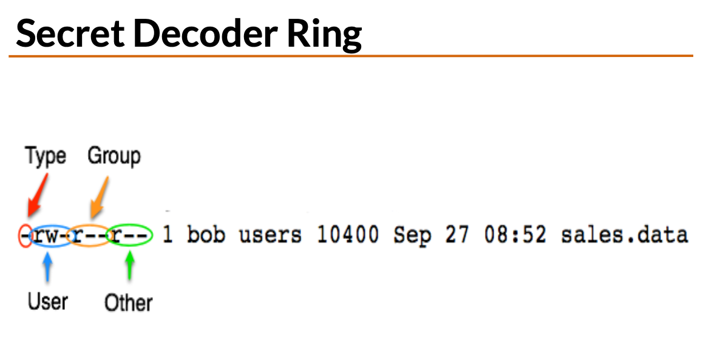
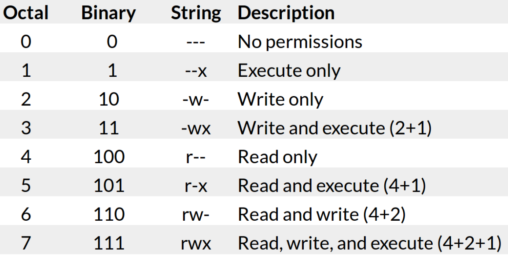
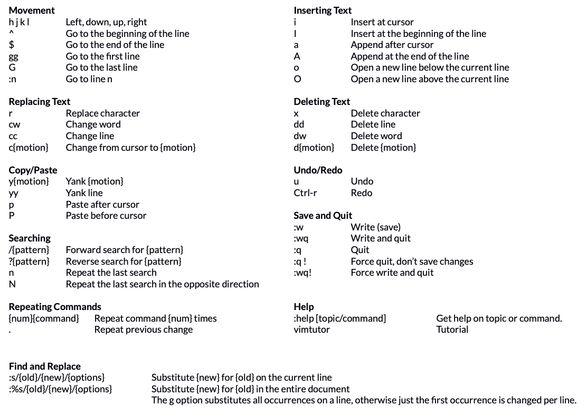
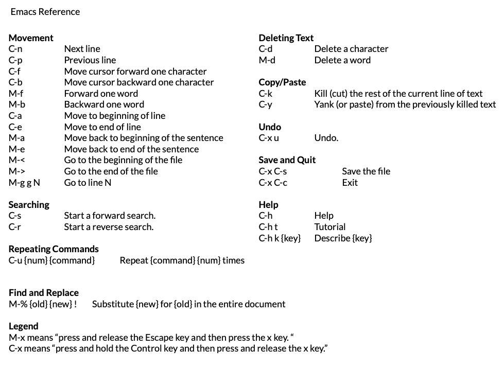

## SSH - Network protocol

- Windows - PuTTY
- Mac - Terminal/ssh command line utility

## Common Linux Directories

- `/` : Root, top file systems
- `/bin`: Binaries and other executable programs
- `/etc`: System config files
- `/home`: Home directories
- `/opt`: Optional or third party software
- `/tmp`: Temporary space, typically cleared on reboot
- `/usr`: User related programs
- `/var`: Variable data, most notably log files
- `/dev`: Device files, typically controlled by the operating system and system admin

## Basic Linux Commands

- `ls` :Lists directory contents.

  - `-a`: List all files, including hidden files.
  - `--color`: List files with colorized output.
  - `-d`: List directory names, not contents.
  - `-l`: Use the long listing format.
  - `-r`: Reverse the order.
  - `-R`: List files recursively.
  - `-t`: Sort by time, most recent first.

- `cd` : Changes the current directory.
- `pwd` : Displays the present working directory.
- `cat` : Concatenates and displays files.
- `echo` : Displays arguments to the screen.
- `man` : Displays the online manual.
- `exit` : Exits the shell or your current session.
- `clear` : Clears the screen.

## Creating and removing directories

- `mkdir directory`: Create a directory
- `rmdir directory`: Remove a directory
- `rm -rf directory`: Recursively remove a directory
- `./` : Current path
- `../`: Parent path

## `$PATH`

- Environment variable
- Controls the command search path
- Contains a list of directories

## Permissions

- Symbols

  - `r` : Read
  - `w` : Write
  - `x` : Execute

- Permission for files and directories are different
  | Permission | File | Directory |
  | ----------- | ------------------------------- | --------------------------------------------------- |
  | Read (r) | Allows a file to be read. | Allows file names in the directory to be read. |
  | Write (w) | Allows a file to modified. | Allows entries to be modified within the directory. |
  | Execute (x) | Allows the execution of a file. | Allows access to contents and metadata for entries. |

- Permission Categories
  | Symbol | Category |
  |--------|----------|
  | u | User |
  | g | Group |
  | o | Other |
  | a | All |

- Running `ls -l` will reveal the type of permission for a file.

- Permissions can be changed
  | Item | Meaning |
  |-------|---------------------------------------|
  | chmod | Change mode command |
  | ugoa | User category user, group, other, all |
  | +-= | Add, subtract, or set permissions |
  | rwx | Read, Write, Execute |

- Octal manner of granting permission

- Default permissions are `777` for directories and `666` for files

## Using VIM to edit text

## Using Emacs to edit text

## Wildcards

- `*` - matches zero or more characters (e.g. `*.txt`, `a*`)
- `?` - matches exactly one character (e.g. `?.txt`)
- `[]` - matches any character included between the brackets. (e.g. `ca[nt]*` will match with `can`, `cat`, `candy`, `catch`)
- `[0-3]` - Matches a range of digits
- `[[:digit:]]` - Matches all digits

## Rediction

- `>` : Redirects standard output to a file. Overwrites (truncating) existing contents.
- `>>` : Redirects standard output to a file. Appends to any existing contents.
- `<` : Redirects input from a file to a command.
- `&` : Used with redirection to signal that a file descriptor is being used.
- `2>&1` : Combine stderr and standard output.
- `2>file` : Redirect standard error to a file.

## Comparing differences in files

- `diff file1 file2`
- `sdiff file1 file2`

## Searching in Files

- `grep`
- `grep -v` : to search the inverse
- `grep -i` : Ignore case when searching
- `grep -c` : Counts the number of case matched
- `grep -n` : Line number of file

## Transferring files over the network

- SCP : Secure copy
- SFTP : SSH file transfer protocol

## Process status `ps`

- `ps -e`: Display all processes.
- `ps -ef` : Display all processes, full.
- `ps -eH` : Display a process tree.
- `ps -e --forest` : Display a process tree.
- `ps -u username` : Display user’s processes.
- `pstree` : Display processes in a tree format.
- `top` : Interactive process viewer.
- `htop` : Interactive process viewer.

## Running jobs

- `command &` : To start a job in the background, where `command` is replaced by the command to start the job
- `bg` : Background
- `fg` : Bring job to the foreground
- `jobs` : List running jobs
- `kill` : Kill job

## Cron

- `cron` : Time based job scheduling
- `crontab file` : Install a new crontab from file.
- `crontab -l` : List your cron jobs.
- `crontab -e` : Edit your cron jobs.
- `crontab -r` : Remove all of your cron jobs.

## Environment vars are name/value pairs

- Can change how an application behaves
- View with `printenv`
- Change environment var with `export VAR="value"`
- Reset environment var with `unset VAR`
- You can edit the environment variable by changing the `.bash_profile` page.
